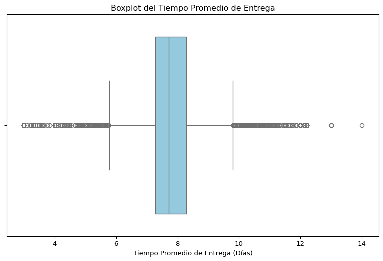
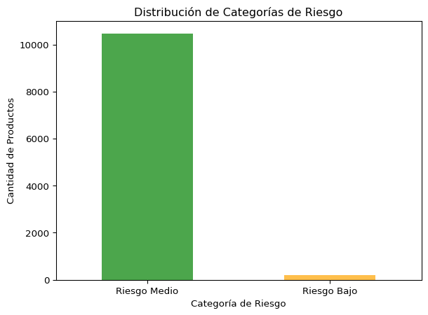
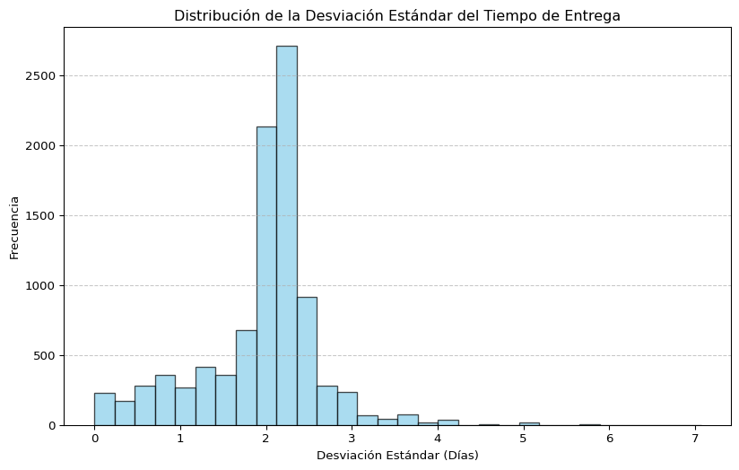
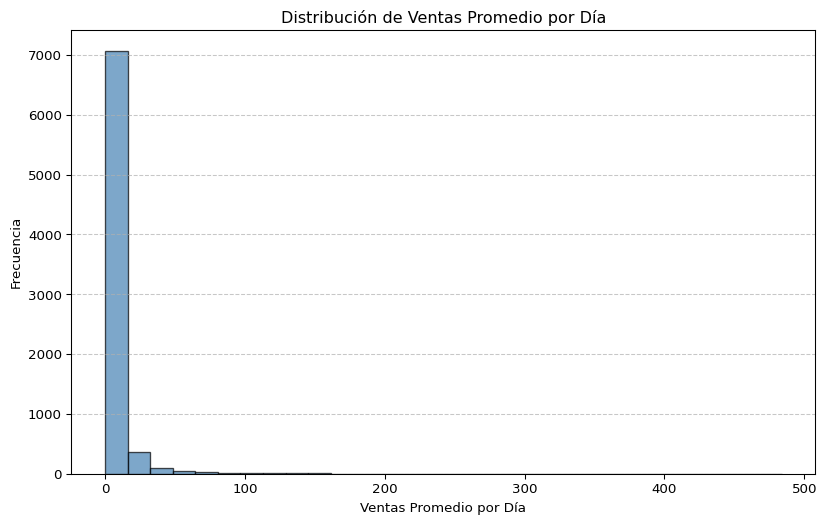
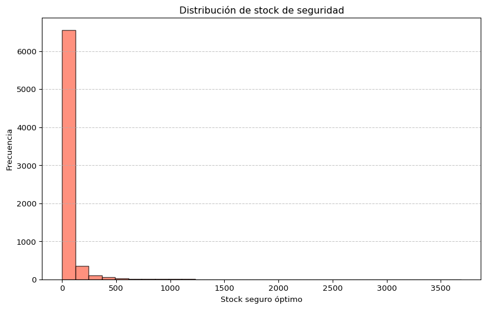
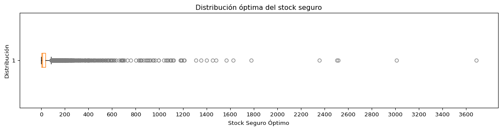
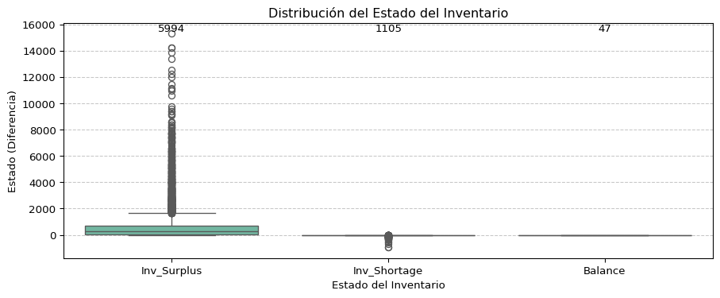
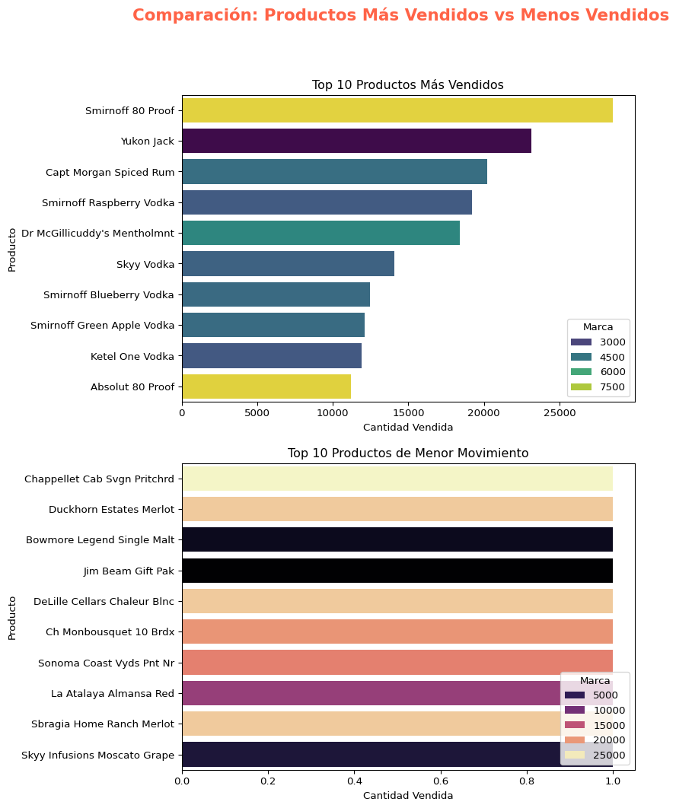
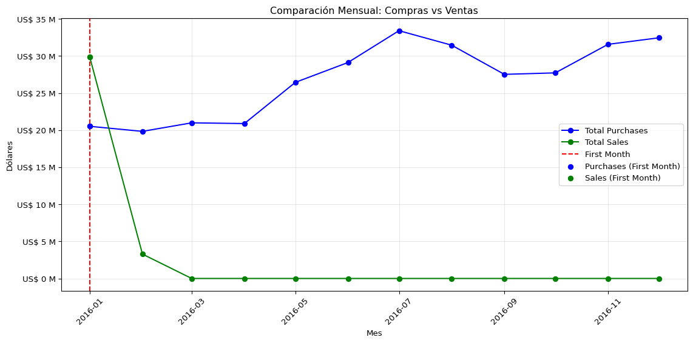
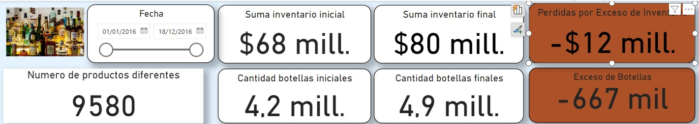

# 🚀Optimización del control de inventario para BottleFlow Logistics: un enfoque estratégico basado en datos #Supply Chain🚀

# Descripción
Imagine ser el cerebro detrás de estantes mayoristas más inteligentes, donde cada producto tiene su momento, se minimiza el desperdicio o perdidas y los clientes siempre encuentran lo que necesitan. Ese es el objetivo de este proyecto! Juntos, nos estamos sumergiendo en un desafío del mundo real: predecir la demanda de inventario para transformar cómo funcionan las cadenas de suministro.

**BottleFlow** **Logistics** es una destacada empresa distribuidora de bebidas alcohólicas en los Estados Unidos, reconocida por abastecer a supermercados, restaurantes, bares y tiendas especializadas en todo el país. A pesar de su éxito comercial, la compañía opera con un modelo de gestión tradicional que limita su capacidad para aprovechar el valor de los datos en la toma de decisiones estratégicas.

__PROBLEMA:__ 

La dirección, basándose en su amplia experiencia en el sector, ha identificado varios desafíos operativos, siendo uno de los más críticos la gestión ineficiente de su stock. Este problema no solo afecta el flujo de distribución, sino que también podría limitar la capacidad de la empresa para competir eficazmente en un mercado cada vez más dinámico y digitalizado.

Consciente de la necesidad de modernizarse, BottleFlow Logistics ha decidido contratar una consultora externa, **"Soluciones Barichara"**, especializada en datos y tecnología. El objetivo es implementar un sistema de gestión de datos más eficiente y desarrollar un análisis profundo de sus operaciones para identificar y solucionar problemas clave. Este proyecto tiene como propósito optimizar sus procesos internos, mejorar la gestión de inventarios y sentar las bases para un crecimiento sostenible y competitivo en el futuro.

# Objetivos:
- Gestionar los niveles de inventario de manera eficaz en todas las categorías.
- Optimizar los costos asociados al almacenamiento y la distribución de productos.
- Integrar datos históricos y en tiempo real para decisiones más precisas.

# Impacto:
- Aumento de la rentabilidad al evitar pérdidas relacionadas con la falta o el exceso de stock.
- Mayor competitividad en el mercado al responder más eficientemente a las demandas del cliente, impulsando así las ventas.
- Implementación de sistemas de previsión de demanda más precisos para ajustar los niveles de inventario a las necesidades reales.

## Tecnologías utilizadas
- Python 
- Power BI 
- SQL 

__Desafíos__ __superados:__ 
- Almacenamiento y consulta eficiente de grandes volúmenes de datos.
- Diseño de bases de datos y optimización de consultas para mejorar el rendimiento.
- Desarrollo de modelos de predicción y análisis de datos avanzados.
- Automatización de tareas relacionadas con la limpieza, transformación y carga de datos desde excel,csv a SQL.

## Análisis de inventario

En esta sección, analizaremos los parámetros fundamentales de la gestión
de inventario y extraeremos información relevante sobre stock e
inventario disponible.

Se buscará:

1.  Detectar y analizar outliers.

2.  Visualizar la información de manera más clara.

3.  Agregar contexto relevante (proveedor, riesgo).

El gráfico de caja muestra la distribución de los plazos de entrega
promedio de los productos. La mayoría de los productos tienen un plazo
de entrega promedio de aproximadamente 7 u 8 días, como lo muestra la
distribución normal. Por lo tanto, la mayoría de los vendedores entregan
los productos en el plazo de una semana.

### Stock de seguridad e inventario disponible

Como el stock de seguridad mide la cantidad de inventario de reserva que
se debe tener, se debe determinar el stock de seguridad óptimo en
función de la cantidad de ventas y la cantidad de stock de seguridad
necesaria para que las ventas se realicen sin problemas.

Los histogramas representan el recuento de stock de seguridad requerido
para cada marca junto con sus ventas diarias promedio. Sin embargo,
debido a que los datos están muy sesgados hacia la izquierda, la
distribución de los puntos de datos en el lado derecho no es claramente
visible. Para poder visualizar esto mejor, utilizaremos un diagrama de
caja.

Como podemos observar, la mayoría de los productos requieren un stock de
seguridad de entre cero y 200. Sin embargo, el diagrama de caja muestra
que algunos productos necesitan hasta 3500 unidades en existencias de
seguridad.

Evaluar el inventario disponible. Se tendra en cuenta el inventario
final, como inventario disponible.

El gráfico muestra que la empresa tiene un inventario excesivo de un 84%
de sus productos, lo que le genera costos de mantenimiento de inventario
sustanciales. Por otro lado, hay un 15% de déficit en el inventario. De
hecho, solo un 1% del inventario presenta un stock equilibrado.

La empresa debe abordar este problema reduciendo el excedente de
inventario y cubriendo los faltantes de inventario para mantener el
equilibrio.

## Analisis de productos más y menos vendidos.

# Análisis adicionales

El gráfico muestra que las compras son mayores que las ventas durante
varios meses consecutivos, esto podría significar que:

- Se está adquiriendo más inventario del necesario.  
- Podría haber un problema de rotación de inventarios, lo que
  conllevaría a costos de almacenamiento elevados.

Si las ventas son mayores que las compras en la mayoría de los meses:

- Esto podría ser positivo, mostrando una buena utilización del
  inventario, pero es importante monitorear para evitar quedarse sin
  existencias.

Mediante el dashboard de PowerBI se evidencia el problema del exceso de
botellas y su implicancia en las pérdidas de la empresa.

## Autores
- [X] Lucel Da Silva
- [X] Melisa Rossi
- [X] Katia Berrios
- [X] Roberto Gil
- [X] Jeniffer Caballero
=======

TABLA DE CONTENIDOS(Incluye una tabla de contenidos para facilitar la navegación en el
README)

# Descripcion

BottleFlow Logistics es una distribuidora de bebidas alcoholicas.  
Distribuimos distintas presentaciones a lo largo del anho.
Cuyo proble a es el sobrestock, stock vacio.

Objetivos:
-Gestionar los niveles de inventario de manera eficaz en todas las categorías.
-Identificar las pautas de la demanda para reducir al mínimo las carencia de stock.
-Crear planes de acción basados en conocimientos basados en datos.

El Impacto que queremos generar:
-Reducción del desperdicio de productos.
-Mejora de la eficiencia operativa.
-Aumentar el beneficio economico.

Tecnologias utilizadas: Python, Power BI, SQL 

desafios superados: Limpieza de datos ,

caracteristicas futuras: 

Prediccion de modelos que identifiquen las proximas tendencias para mejorar la planificacion de la demanda.
Elaboracion de planes de mejora de procesos para mejorar la satisfaccion del consumidor.

###ESTRUCTURA Y FUNCIONALIDADES (Utiliza una estructura lógica y fácil de seguir, con subtítulos y secciones claras)

###CODIGO ( Incluye fragmentos de código relevantes y explique su función)

###RECURSOS ADICIONALES (Enlaces a recursos adicionales, como documentacion tecnica, o wiki del proyecto)

###IMAGENES Y VIDEOS/AENXOS(Agrega imágenes y videos para ilustrar el funcionamiento y características
del proyecto)

