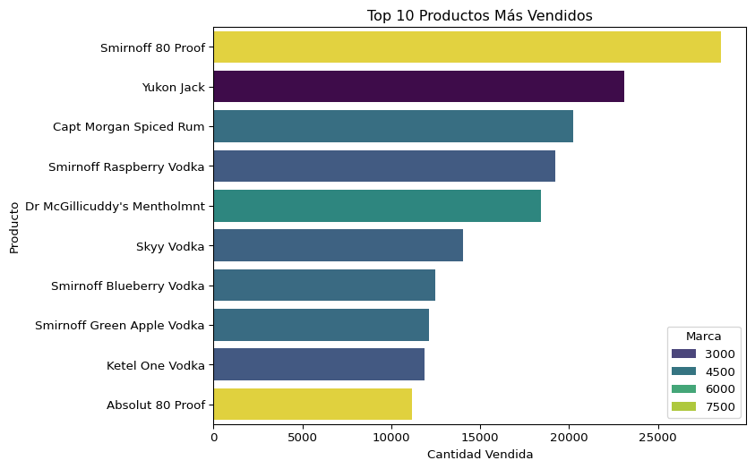
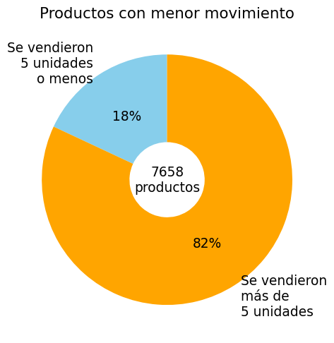

# 🚀Optimización del control de inventario para BottleFlow Logistics: un enfoque estratégico basado en datos #Supply Chain🚀

# Descripción
Imagine ser el cerebro detrás de estantes mayoristas más inteligentes, donde cada producto tiene su momento, se minimiza el desperdicio o perdidas y los clientes siempre encuentran lo que necesitan. Ese es el objetivo de este proyecto! Juntos, nos estamos sumergiendo en un desafío del mundo real: predecir la demanda de inventario para transformar cómo funcionan las cadenas de suministro.

**BottleFlow** **Logistics** es una destacada empresa distribuidora de bebidas alcohólicas en los Estados Unidos, reconocida por abastecer a supermercados, restaurantes, bares y tiendas especializadas en todo el país. A pesar de su éxito comercial, la compañía opera con un modelo de gestión tradicional que limita su capacidad para aprovechar el valor de los datos en la toma de decisiones estratégicas.

__PROBLEMA:__ 

La dirección, basándose en su amplia experiencia en el sector, ha identificado varios desafíos operativos, siendo uno de los más críticos la gestión ineficiente de su stock. Este problema no solo afecta el flujo de distribución, sino que también podría limitar la capacidad de la empresa para competir eficazmente en un mercado cada vez más dinámico y digitalizado.

Consciente de la necesidad de modernizarse, BottleFlow Logistics ha decidido contratar una consultora externa, **"Soluciones Barichara"**, especializada en datos y tecnología. El objetivo es implementar un sistema de gestión de datos más eficiente y desarrollar un análisis profundo de sus operaciones para identificar y solucionar problemas clave. Este proyecto tiene como propósito optimizar sus procesos internos, mejorar la gestión de inventarios y sentar las bases para un crecimiento sostenible y competitivo en el futuro.

# Objetivos:
- Gestionar los niveles de inventario de manera eficaz en todas las categorías.
- Optimizar los costos asociados al almacenamiento y la distribución de productos.
- Integrar datos históricos y en tiempo real para decisiones más precisas.

# Impacto:
- Aumento de la rentabilidad al evitar pérdidas relacionadas con la falta o el exceso de stock.
- Mayor competitividad en el mercado al responder más eficientemente a las demandas del cliente, impulsando así las ventas.
- Implementación de sistemas de previsión de demanda más precisos para ajustar los niveles de inventario a las necesidades reales.

## Tecnologías utilizadas
**_Análisis de datos:_**
- Python 
- Power BI 
- SQL 
- Google Cloud 

**_Herramientas de colaboración y gestión de proyectos_**
- Trello 
- Google Meet 

__Desafíos__ __superados:__ 
- Almacenamiento y consulta eficiente de grandes volúmenes de datos.
- Diseño de bases de datos y optimización de consultas para mejorar el rendimiento.
- Desarrollo de modelos de predicción y análisis de datos avanzados.
- Automatización de tareas relacionadas con la limpieza, transformación y carga de datos desde excel,csv a SQL.

## Análisis de inventario

En esta sección, analizaremos los parámetros fundamentales de la gestión
de inventario y extraeremos información relevante sobre stock e
inventario disponible.

Se buscará:

1.  Detectar y analizar outliers.

2.  Visualizar la información de manera más clara.

3.  Agregar contexto relevante (proveedor, riesgo).

El gráfico muestra que la empresa tiene un inventario excesivo de un 84%
de sus productos, lo que le genera costos de mantenimiento de inventario
sustanciales. Por otro lado, hay un 15% de déficit en el inventario. De
hecho, solo un 1% del inventario presenta un stock equilibrado.

La empresa debe abordar este problema reduciendo el excedente de
inventario y cubriendo los faltantes de inventario para mantener el
equilibrio.

## Analisis de productos más y menos vendidos.

# Análisis adicionales

El gráfico muestra que las compras son mayores que las ventas durante
varios meses consecutivos, esto podría significar que:

- Se está adquiriendo más inventario del necesario.  
- Podría haber un problema de rotación de inventarios, lo que
  conllevaría a costos de almacenamiento elevados.

Si las ventas son mayores que las compras en la mayoría de los meses:

- Esto podría ser positivo, mostrando una buena utilización del
  inventario, pero es importante monitorear para evitar quedarse sin
  existencias.

Mediante el dashboard de PowerBI se evidencia el problema del exceso de
botellas y su implicancia en las pérdidas de la empresa.

## Autores
| Nombre                                      | Rol             |
|---------------------------------------------|-----------------|
| [María Agustina Cuello](https://github.com/ChichiCuello) | Team Leader |
| [Katia Berrios](https://github.com/KtiaBM) | Data Analyst |
| [Melisa Rossi](https://github.com/MelRossi) | Data Analyst |
| [Roberto Gil](https://github.com/Cargila) | Data Analyst |
| [Jeniffer Caballero](https://github.com/Corazonjesus2019) | Data Scientist |
| [Lucel Da Silva](https://github.com/luceldasilva) | Project Manager |
